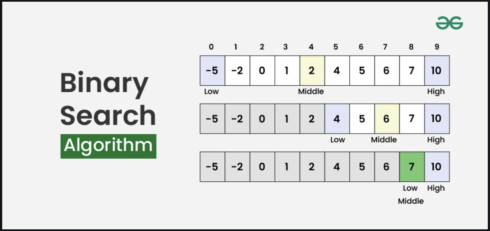
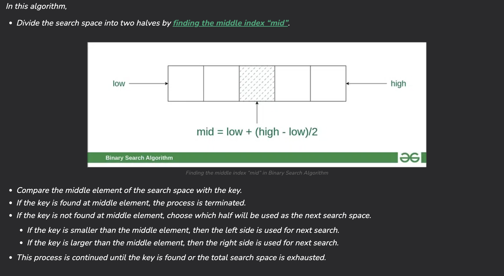
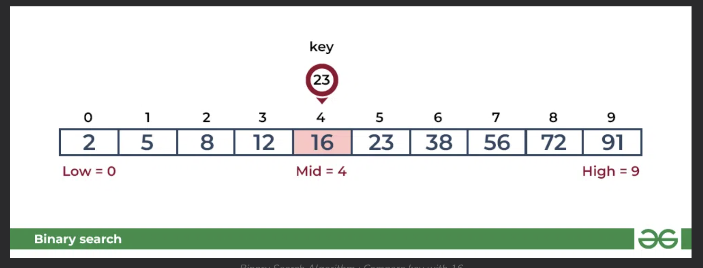
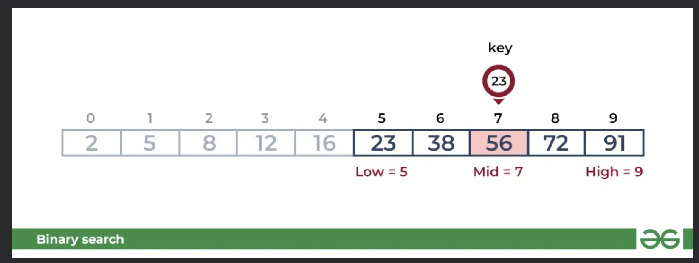
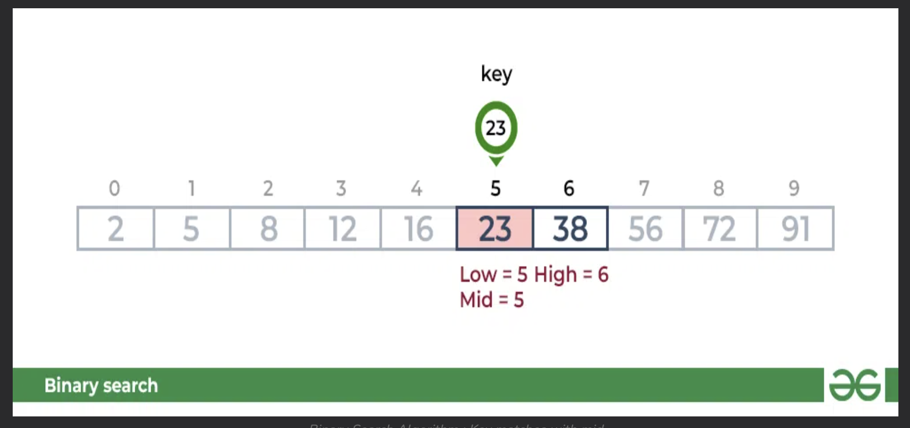

# BINARY SEARCH ALGORITHM
Binary Search is a simple <u>searching algorithm</u>. It works by repatedely dividing he search interval by half.

### How it works

'
#### Step by Step
1. Check to see where the target is compared to the middle

2. Check to see where the target is to the *new middle*

3. If the target matches the value, the target is found

You can learn more about it on [Geek for Geeks](https://www.geeksforgeeks.org/binary-search/).

## Time Complexity
Best Case: O(1)

Average Case: O(log n)

Worst Case: O(log n)