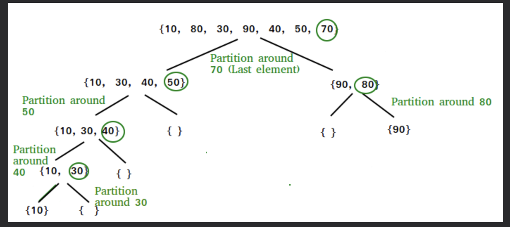
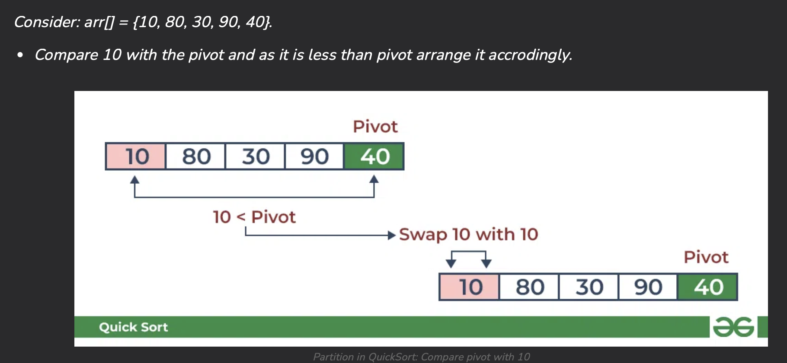
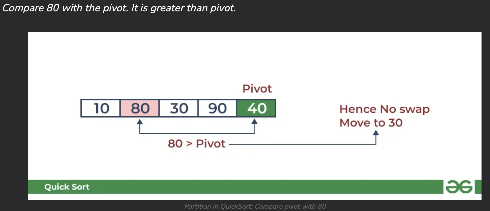
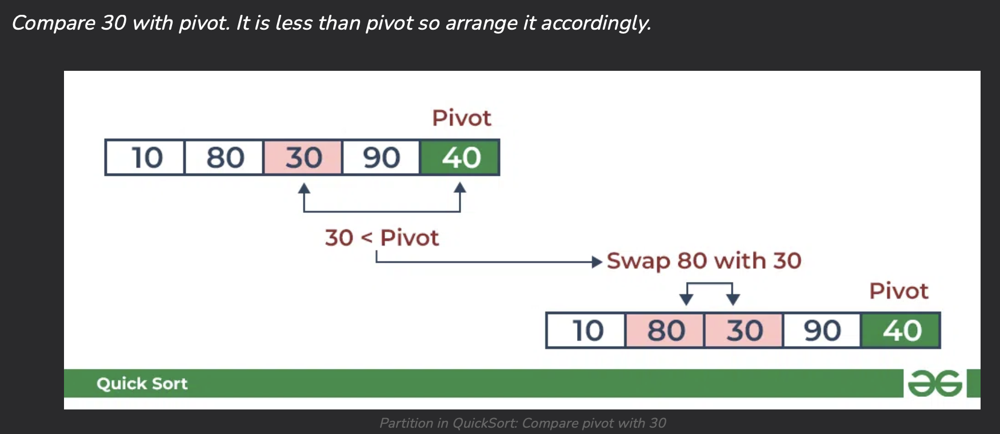

# QUICK SORT ALGORITHM
Quick Sort Algorithm is based on the <u>Divide and Conquer algorithm</u> which picks an element as a pivot. The algorithm then partitions the array around the pivot, sorting the array.

### How it works

You can learn more at [Geek for Geeks](https://www.geeksforgeeks.org/quick-sort/)